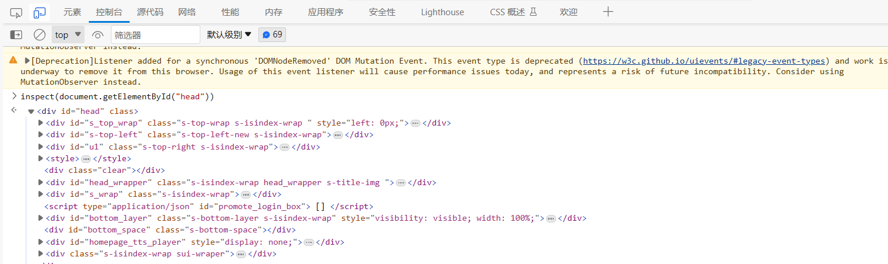

各个Tab介绍
1、打开Dev Tools
（1）菜单->更多工具->开发工具
（2）快捷键：F12
2、打开命令菜单
（1）快捷键：CTRL+SHIFT+P、Command+SHIFT+P(MAC)
（2）DevTool的黑色主题
（3）截屏
（4）dock
3、常用的Tab（面板）：Element、Console、Source、Network、Application

CSS调试
1、检查元素
2、查询DOM树
（1）快捷键：CTRL+F（或Command+F）->弹出一个搜索框->直接搜

（2）查询方式：
- 1）文本查询 eg：section-><section></section>
- 2）CSS选择器 eg:section#section_one表示id为section_one的section标签-><section id="section_one"></section>
- 3）Xpath eg：//section/p->表示在全局范围下找section标签下的p标签
3、控制台（Console）：inspect()方法  eg：inspect（document.getElementById("head")）

编辑样式

控制台（Console）
1、快捷键：Ctrl+Shift+J
2、执行语句
3、$_返回上一条语句的执行结果
4、$0上一个选择的DOM节点（$1、$2...）
5、console.log/error/warn/table/clear/group/time/assert/trace
6、Log级别筛选

JS断点调试：每个按键的说明：
1． Step over（F8） 步过，
如果当前行断点是一个方法，则不进入方法体内。
2． Step into（F7） 步入，
一般用于进入自定义方法内，不会进入官方类库的方法。
3． Force step into（Alt + shift + F7） 强制步入，
能进入任何方法，查看底层源码的时候可以用这个进入官方类库的方法。
4． Step out（Shift + F8） 步出，
从步入的方法内退出到方法调用处，此时方法已执行完毕，只是还没有完成赋值。
5． Drop frame 回退断点
6． Run to Cursor (Alt + F9)：运行到光标处，你可以将光标定位到你需要查看的那一行，然后使用这个功能，代码会运行至光标行，而不需要打断点。
7． Evaluate Expression (Alt + F8)：计算表达式

🔺可以查看不同浏览器下网页运行情况，可以解决兼容性问题

🔺问题情景：用户测试代码有问题，但操作人员在本地测试没问题，如何查看这种错误情况：
解决：
（1）用户：右击打开检查->网络->导出HAR文件->发送给技术人员
（2）技术人员：导入HAR文件：即可看到用户测试该页面代码的情况

